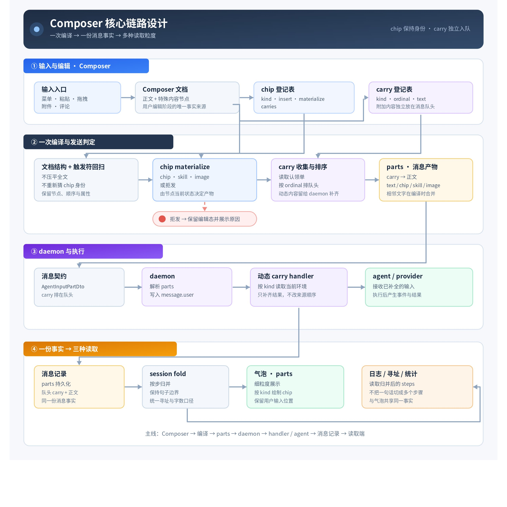

# Composer 优化设计方案 v2

> 本地归档信息（非原文）
>
> - 归档日期：2026-10-02。原调研日期为 2026-09-28。
> - 正文版本：revision 556；通过指定该 revision 读取。
> - 文档 ID：`MPLTdtVkPojMSVx5uYHcKz5knXg`。
> - 原始读取结果：[Markdown 完整响应](raw/composer-design-v2.fetch.json)、[XML 完整响应](raw/composer-design-v2.fetch-xml.json)，均保留正文及引用 sidecar。
> - 评论范围：本次 `docs +fetch --as user` 未返回评论。这里只记录本次可读范围，不代表该文档从未有评论，也不构成 2026-09-28 的评论快照。
> - 本地化范围：仅替换资源和引用；正文表格、代码及原有措辞保留。四份归档来源互相引用时使用本地文件，其他文档引用只保留名称；原始响应保留原始引用，供核对。
> - 画板：1 张，已保存为本地 JPEG；获取日期为 2026-10-02，历史版本限制见正文图片下方说明。

<!-- 原文正文开始 -->
> 这份设计把 Composer 里已经零散存在的 chip 和 carry 收成一条链路,功能上让文件、引用、命令、技能、图片在输入框和气泡两处长得一样并统一悬浮预览、单击跳转、双击看全文,同时补齐命令 chip 的三层归属、给 carry 定下 added/chip/ambient 三类来源与生命周期、把评论收敛成队头 pill 并移除 task-context,实现上每个 kind 只写一份 Definition 供输入框与气泡共读,发送时编译成 carry 在前的 text/chip/skill/image/carry 五支 parts,由 daemon 按 kind 找 handler 补全后落成唯一事实来源 message.user,气泡不再靠正则反推对象。

## 1 这份设计要解决什么

这是 Composer 的一次优化。核心是 chip 和 carry 这条链路，其余几项是跟着它一起做的体验修补。

Composer 处理的不是一段普通字符串。

用户可能在一句话中插入文件、引用、命令、技能或图片。输入框里，这些内容有自己的展示方式；发送后，用户又希望在气泡里看到与自己刚才输入相同的内容和排版。与此同时，系统还可能根据这次输入附带一些说明，例如空间介绍、引用说明或评论摘要。这些附加内容显示在消息队头，告诉用户本轮输入会带来什么影响。

这些能力当前已经存在，只是覆盖范围和实现方式不完整：

- 有些特殊内容已经能以 chip 形式展示，有些内容仍会被压成普通文本；
- 气泡侧的 chip 识别依赖正则扫描或固定类型列表，新增一种 chip 就要增加一套逻辑；
- carry 已经能在部分场景下出现，但它的生成、顺序、移除和持久化规则分散在不同代码路径；
- Composer 和气泡有时需要分别推断同一份内容，导致特殊块的属性丢失，或者展示结果不一致。

用户看到的是几个已经存在的功能，代码里却没有一个对象模型能说明它们怎么共同工作。这份设计把它们收成一条能长期维护的链路。

## 1.1 现状问题

- **chip类型覆盖未完全**

文件、引用、评论、技能、图片已有特殊展示，`/` 命令没有自己的一套 chip 覆盖规则。评论不做成 chip，只以队头的 carry 出现。

- **chip、carry 的交互行为定义不完整**

当前只有部分内容支持悬浮预览、单击或双击，行为散落在不同组件中；没有按对象自身特点统一声明这些行为的机制，也缺少双击打开浮窗查看全文的通用能力。

- **chip 的对象身份无法还原**

编辑器节点保存了类型和属性，但发送后通常被转换成文本或其他专用 part；气泡拿不到完整的原始身份和属性，无法稳定还原输入时的对象。

- **输入框和气泡使用不同的识别与展示方式**

输入框按编辑器节点绘制，气泡按固定 part 类型或文本扫描恢复；同一内容在两处可能显示不同，新增类型也要重复补逻辑。

- **carry 的来源和生命周期分散**

space-brief、引用说明、评论和 workflow 简报分别由不同流程生成和移除，没有统一记录它们为什么产生、对应什么输入以及何时结束。

- **carry 的顺序和队头识别依赖固定位置**

当前通过编译时前插、评论特殊插入和气泡固定类型判断 carry；一旦新增或调整一种 carry，容易影响正文顺序或队头判断。

- **命令在不同入口下的语义不一致**

菜单选中、Enter、Tab、手动输入和发送前回扫可能分别得到执行、普通文本或命令胶囊；用户难以判断最终会发送什么，以及消息中会保留什么。

- **技能的身份和可查看内容无法完整保留到气泡**

输入框保存了技能地址，落库和气泡主要只保留名称快照；气泡无法根据原地址读取当前描述或打开技能正文。

## 2 先把两类内容分开

Composer 中有两类需要被系统识别的对象。

### chip：用户输入内容的一部分

chip 出现在用户正在编辑的文档里。它占据文档中的一个位置，用户可以整体插入或删除它，不能像普通文本一样在内部编辑。

文件、引用和命令都属于这一类。技能和图片在发送协议中有自己的块类型，在 Composer 和气泡里也是用户输入中的特殊内容。

chip 解决的是一个用户问题：

> 我输入的这一部分到底是什么，发送后会以什么内容进入消息？

它保留自己的类型、发送时的文本和必要的结构化属性。气泡不应该通过重新扫描文本来猜测它是什么。

### carry：Buffin 附加在消息队头的内容

carry 不属于用户自己输入的正文。它由 Buffin 根据用户输入、会话环境或用户主动操作生成，独立放在消息队头。

例如，用户在 Composer 中插入一个物料区文件后，系统可能在队头显示 space-brief；用户附加页面评论后，系统可能在队头显示评论摘要。

carry 解决的是另一个用户问题：

> 这次输入除了我写下的正文，还会让系统带上什么内容？

两种来路都算。有的是这次输入带出来的，例如插入一个物料区文件后，队头就多一段 space-brief。有的是这个会话已经成立的状态，例如这个会话已经介绍过空间，队头声明的是这件事仍然成立。

carry 和 chip 可以有关联，但不是同一类对象。chip 可以触发 carry，carry 独立于正文存在。

## 3 用户希望看到的链路

### 输入时：敲出来就知道自己做对了

chip 的作用不是让用户看得懂，是让用户一眼看出这是个特殊的东西。用户敲出 `@src/app.ts`，它当场变成一枚块，就知道自己写对了。没变成块，就是没认上。这个反馈要在按下发送之前给，而不是发出去才知道系统把它当成了什么。

当某个 chip 会触发 carry 时，Composer 在队头给出提示。这个提示的作用是让用户提前知道输入的影响，而不是把 carry 假装成用户写进正文的文字。

### 查看时：确认内容方便快捷

用户看到 chip 或 carry 时，不必先离开当前页面去找它代表的内容。悬浮就能看到这个对象的预览，确认个大概。预览不够时，单击去那儿，双击在这儿看：要定位的单击跳到对应文件或窗口，要阅读的双击打开浮窗看全文。输入框正文里的双击是编辑动作，那里靠悬浮预览确认，看全文去气泡或队头。

### 发送后：前后的视觉体验一致

发送后，用户输入内容进入气泡正文：

- 普通文本保持原有排版；
- chip 按对应类型展示；
- chip 的顺序和文本位置与 Composer 中的用户输入保持一致；
- chip 的展示和交互读它自己的结构化属性，不从正文里正则认。

carry 单独显示在气泡队头。它不是正文的一部分，也不参与用户正文的排版。

### 扩展时：新增一种内容只说明它怎么工作

接入一种新 chip 时，只需说明它如何进入输入框、发送后代表什么、如何绘制，以及用户悬浮、单击、双击时能看到和做什么。输入框、消息气泡和 carry 都读这一份定义，不用在几个位置各写一遍。

## 4 核心架构



> 归档说明：画板图片获取于 2026-10-02。正文使用 revision 556；资源接口未提供对应历史版本的画板快照，因此不保证图片与历史正文同期。

## 5 这份设计要建立的能力

### 让 chip 成为可管理的对象

一种 chip 的行为如果分别写在插入、发送和绘制三处，就没有一处能答出它怎么进来、发出去值什么、会带出什么。新增一种要沿着这三处各改一遍，漏掉一处的表现是发出去少一截，或者气泡画不出来。

每种 chip 由一个 `ChipDefinition` 统一声明，一处说明这几件事：

- 它是什么类型，如何插入 Composer；
- 发送时产生什么内容；
- 它会带出哪些 carry；
- 输入框和气泡如何绘制，以及悬浮、单击、双击如何处理。

这些能力按字段组合在同一个 Definition 里。Definition 只持有能力，不是某一轮输入里的 chip 实例；节点属性、认领结果和消息 part 是运行时数据。一个 kind 的实现可以按职责拆成多个文件，但只导出一份 Definition。

### 让 carry 有清楚的来源和生命周期

每种 carry 由一个 `CarryDefinition` 统一声明：它是什么、排第几、固定文案是什么，以及在输入框和气泡里怎么绘制和交互。

carry 独立于 chip 管理，chip 不生成 carry 的固定内容，只交出一张认领单：说明这一轮要带哪一种 carry，以及本轮才知道的 `text` 或 `data`。carry 的固定含义、顺序和展示能力由自己的 Definition 决定。

每条 carry 还要记录它为什么存在，以及它是否继续存在。来源分三类：

| 来源 | 含义 | 生命周期 |
|-|-|-|
| `added` | 从输入框外主动加入 | 编辑期间由主动操作决定是否移除 |
| `chip` | 由 Composer 中的 chip 带来 | 对应 chip 移除后一起移除 |
| `ambient` | 环境条件已经成立并持久化 | 不随当前编辑动作移除 |

来源是这一轮的状态，不是一条 carry 的固定属性。同一种 carry 可以这一轮由 chip 带来，下一轮以 ambient 出现。

发送成功后，除 ambient 外的 carry 一律从 Composer 移除，发送失败则保留。这是通用逻辑，不由某一种 carry 自己规定。

来源信息只用于前端管理，不作为消息内容发送给 agent。

carry 在 Composer 阶段由 Definition 给出类型、顺序和能确定的固定内容；发送时，独立的内容准备逻辑收集这些内容；某项信息需要后端能力时，carry 连同已知内容交给 daemon handler。handler 只读环境、补结果，不动 carry 的来源、顺序和基础文案。

### 让用户内容只有一份事实来源

把文档压平成一段字符串、再从字符串里认回特殊内容，是这条链路上最容易出事的一步：压平丢属性，认回靠猜。同一份输入因此会在发送、落库和展示三个阶段各得到一个版本。

这份事实来源是 daemon 处理后的 `message.user`。气泡、日志和 provider 都从它读，不各自再解释一遍用户输入。

发送时，Composer 以文档结构为主，不把整份文档压平成字符串再恢复特殊内容，只在其中的文本节点上做一次触发符回扫。回扫是认：认得出就当场变成 chip，认不出保留原文。它避开的是压平丢属性那一半，不是认回靠猜那一半。留着它的理由是认的结果在发送前就摆在输入框里，用户看得见也改得动；发送之后没有人再认第二次。

编译时分别保留 carry 列表和正文 part 列表；发送前按“carry 在前、正文在后”的顺序拼接为一个 `parts` 数组，各块保留自己的类型和结构化属性：

```
carries：本轮附加在队头的 carry 块
parts：用户输入正文中的文本、chip、技能和图片等块
```

chip 至少保留：

```
kind：它是哪一种 chip
text：它在这条消息中的文本值
data：重建 chip 外形、以及认出它是哪一个所需的结构化属性
```

Definition 按 `kind` 结合对象的 `data` 和当前上下文提供查询、展示或执行能力。daemon 不需要理解每一种 chip 的界面细节，也不通过读取前端属性来决定气泡怎么画。

发送给 agent 的文本、消息记录中的结构和气泡展示使用同一次编译结果。这样用户输入内容不会在不同阶段被分别解释。

## 6 契约

契约只写链路里需要跨模块对齐的部分。各处实现可以用自己的内部类型，但不能改这些边界。

### 对象定义

chip 和 carry 是两类对象，不合并成一张带 `role` 的表。统一的是登记方式：一个 kind 一份 Definition，能力按字段组合在这份 Definition 中。

#### Chip

chip 是用户输入内容中的一个结构化实体。它占据 Composer 文档中的一个位置，用户可以整体插入或删除，不能像普通文字一样编辑内部结构。

一枚 chip 的核心事实是：

| 属性 | 含义 |
|-|-|
| `kind` | 它属于哪一种 chip |
| `text` | 它在这条消息中的文本值；可以为空串 |
| `data` | 重建外形、识别具体对象和执行交互所需的结构化属性 |

chip 的具体实例来自 Composer 节点或消息 `parts`，不是来自 Definition。Definition 只说明这种 chip 如何插入、发送、认领 carry 和绘制；同一个 kind 可以承载不同的具体对象。

#### Carry

carry 是 Buffin 附加在消息队头的结构化实体。它不占据用户正文中的位置，也不由用户直接编辑；它可以由 chip 认领，也可以由输入框外的主动操作或已经成立的环境状态加入。

一条 carry 的核心事实是：

| 属性 | 含义 |
|-|-|
| `kind` | 它属于哪一种 carry |
| `text` | 这次消息中展示和发送的内容；固定部分来自 CarryDefinition，本轮变化部分来自认领单 |
| `data` | 文本之外的结构化内容，供对应读取端或 handler 使用 |

carry 的来源和生命周期只用于前端管理，不进入发送给 agent 的内容。carry 在一轮消息中按 `kind` 合并为一条，按 Definition 声明的顺序排在正文之前。

#### ChipDefinition

`ChipDefinition` 持有 chip 的身份和能力：这种 chip 如何进入 Composer、如何发送、如何认领 carry，以及如何在界面里呈现。

每种 chip 的 Definition 可以包含以下能力：

| 能力 | 作用 |
|-|-|
| `kind` | 对象身份 |
| `extension` | 建立该节点类型的编辑器扩展 |
| `insert` | 菜单插入后的收尾；未提供时使用通用收尾 |
| `claims` | 读取这枚 chip 的属性，算出它认领哪些 carry；不认领就是空 |
| `emit` | 发送时生成 chip、skill、image，或判定这枚 chip 不可发送 |
| `draw` | 按 composer / bubble 提供绘制；未提供时使用通用外观 |
| `preview` | 悬浮预览；未提供时展示 `text` |
| `click` | 单击做什么，常规用法是跳转或定位（可选） |
| `doubleClick` | 双击做什么，常规用法是打开浮窗看全文（可选） |

`claims` 是纯的、同步的，只读这枚 chip 的属性和上下文；编辑时用于队头预览，发送时的结果进入消息。`emit` 只在发送时调用，结果属于本次编译，不是节点的持久属性。`emit` 判定不可发送时，这次发送停在这枚 chip 上；它答的是这枚 chip 自己完不完整，跟命令的拒发不是一套。

`draw` 可以按界面分别提供组件；同一个 kind 在输入框和气泡中可以是不同组件。组件需要的状态和事件由组件自己处理，Definition 只负责把能力接上。

交互按手势分三位：`preview` 接悬浮，`click` 接单击，`doubleClick` 接双击。这三位只是位置，里面放什么逻辑由这种 chip 自己写。常规用法是单击去那儿、双击在这儿看，也就是单击跳到对应文件或窗口，双击开浮窗看全文。同一个 kind 可以只登记其中一两位。悬浮总有预览，`preview` 没登记就展示 `text`；单击和双击没登记就没有这个行为。

#### CarryDefinition

`CarryDefinition` 持有 carry 的身份和能力：固定文案、队头顺序，以及它在界面里的呈现和交互。

每种 carry 的 Definition 可以包含以下能力：

| 能力 | 作用 |
|-|-|
| `kind` | 对象身份 |
| `ordinal` | 队头次序 |
| `text` | 这种 carry 的固定主体文案，允许为空串 |
| `draw` | 按 composer / bubble 提供绘制；未提供时使用通用外观 |
| `preview` | 悬浮预览；未提供时展示 `text` |
| `click` | 单击做什么，常规用法是跳转或定位（可选） |
| `doubleClick` | 双击做什么，常规用法是打开浮窗看全文（可选） |

carry 的固定文案由自己的 Definition 给出，认领方只补本轮变化的内容；需要后端能力的部分由对应 handler 补齐。`source`、`ordinal` 这类管理字段不进 wire。

```ts
// chips/reference/index.ts
export default defineChip({
  kind: 'referenceChip',
  extension: referenceExtension,
  claims: referenceClaims,
  emit: referenceEmit,
  draw: { composer: ReferenceComposer, bubble: ReferenceBubble },
  preview: referencePreview,
  click: openReference,
})

// carries/comment-delivery/index.ts
export default defineCarry({
  kind: 'buffin.comment-delivery',
  ordinal: 40,
  text: '……',
  draw: { composer: CommentComposer, bubble: CommentBubble },
})
```

Definition 的发现与组合

一个目录只提供一个声明入口，声明入口可以引用同目录下按职责拆分的实现文件：

```text
chips/
  reference/
    index.ts
    emit.ts
    view.tsx
    preview.tsx
carries/
  comments/
    index.ts
    view.tsx
```

### 传输契约

wire 上该有几种块，如果没有判据，每加一种内容就会顺手加一支，协议跟着界面一起长。这一节先定判据，再定支数。

编译的产物是一份 `parts` 数组：carry 在前，正文在后。消息中保存的就是这个顺序，用户和其他客户端看到的也是这个顺序。

wire 上只有五支：文字、chip、技能、图片、carry。判据是一个块只要在这条链路上有人区别对待，就需要自己的类型；没人区别对待的都是文字。今天的区别对待有四件：技能要展开成整份内容，图片要交给 provider 的图片块，chip 要在气泡里按身份绘制和交互、也可能由 daemon 按 `kind` 补全，carry 要排在队头并由 handler 补全。四件各占一支，剩下的归文字，正好五支。

```ts
interface AgentInputPartDto {
  type: 'text' | 'chip' | 'skill' | 'image' | 'carry'
  text?: string
  kind?: string
  ref?: JsonValue
  data?: JsonValue
}
```

各支的约束：

| 支 | 由谁写 | 约束 |
|-|-|-|
| `text` | 前端 | 归并时相邻的文字类块拼回一块 |
| `chip` | 前端 | `data` 供前端绘制，登记了 handler 的 kind 由 daemon 读写 |
| `skill` / `image` | 前端给出地址 | 地址放在 `ref`，daemon 按它展开；这两支没有 `kind`，也没有 `data` |
| `carry` | 前端声明与独立的内容准备逻辑，daemon 按需补全 | 排在队头；固定 `text` 来自 carry Definition，动态内容由 handler 按需补充 |

Carry 来源和 `ordinal` 不进入 wire，只留在前端。

daemon 侧不开新入口：开启一轮的那个方法接收 `parts`，解析阶段按 `kind` 找到对应 handler 补全，carry 和 chip 都可能有 handler；落库走 `message.user` 事件，carry 与正文一起写在 `parts` 里。

入站与落库是两个形状，各答各的问题：入站说明这个包怎么再找到，落库记录这条消息当时称呼它什么。技能按这个分开，入站带地址，落库另存名称快照、地址窄一档，两边不合并。

### 后端补全

前端和 daemon 如果都能决定一条 carry 值什么，来源、顺序和固定文案就会被后端顺手改写，carry Definition 就不作数了。这一节把两侧各自能动的部分切开。

| 阶段 | 负责方 | 约束 |
|-|-|-|
| 生成 carry 认领单和可确定内容 | Composer 的独立内容准备逻辑 | 不做 IO，不读取 daemon |
| 展示 carry 预览 | 对应 Definition | 根据输入框当前上下文决定展示哪些已知信息 |
| 获取动态信息 | daemon handler | 按 `kind` 补全 carry 或 chip，不改变来源和顺序 |
| 保存最终消息 | daemon 既有流程 | 保存包含 carry 的最终 parts |
| 展示消息 | 各读取端 | 读取消息事实，不从文本反推对象 |

需要后端能力的块由对应 handler 按当前状态处理。补齐并持久化的内容在上下文压缩后保留；显式清空上下文时，按清空规则重置。

### 读取模型

| 读取端 | 使用的数据 | 目的 |
|-|-|-|
| 气泡 | `parts` | 按位置展示 carry、文本与 chip |
| 日志、寻址、统计 | `steps` | 按消息块寻址，统一的对话统计口径 |
| agent/provider | daemon 处理后的输入 | 获得与原输入语义一致的内容 |

`steps` 走 session-fold 的读取方式：按 run 组织消息，`stepsOf` 把每个 `MessagePart` 映射成一个 step。carry 同样留在 `Message.parts` 里，进入 steps；这里不另设按句子切分或归并的规则。

**step** 是 `buffin session log` 的寻址单位，也是评论锚点的坐标。

**daemon 处理后的输入** 是同一条消息交给 agent / provider 的那一份：动态 carry 已补全，技能和图片按 provider 需要展开。它由消息内容转换得到，转换结果不回写气泡和日志共读的那份消息结构。

## 7 样式约束  

### 颜色

整体采用高透底与弱边界的通透质感，色彩按系统职责明确分配：**Ember 暖橙**分配给**命令系统**，作为输入区的最高视觉焦点；**紫色**分配给**技能系统**，表达调用的能力；**钢蓝色**分配给**文件系统**，代表具体被引用的操作材料；实体引用分配靛青色 ; 图片则由图片内容决定 

### 图标

见实现

### Hover 与浮窗行为

采用两层渐进披露设计：**Hover** 负责**即查即走的意图说明与内容速览**，专注呈现实体名称与文本摘要，保障连续的输入心流；**浮窗**由**双击唤起**，负责展开完整代码、长篇技能文档或管理界面，在顶栏提供可选的需要能力，并根据所处阶段提供操作权限——评论carry的浮窗于待发送的输入框侧支持编辑与删除，已发送的历史气泡侧则作为存档保持只读。

### 点击

点击作为一种显式的轻量触发行为，用于承载一步到位的交互意图：允许直接跳转至目标位置、展开对应的内容列表或呼出操作菜单，让高频的导航与浏览诉求能够快速响应   
支持单击和双击两种不同的行为 

## 8 相关细节

### chip 如何认领 carry

认领方如果连内容一起交出来，同一种 carry 的措辞就随触发它的那枚 chip 变。这一节定的是认领单里能放什么、不能放什么。

编辑时，文档中的已识别对象参与 carry 收集；发送时会再回扫一次输入，把能识别的手打触发符写法转成 chip，再遍历对象，调用各自的 `claims` 收集认领单。

一张认领单只有三样东西：

```
kind：认领哪一种 carry
text：内容随这一轮变的，认领时一并交出（可空）
data：那段话表达不了的结构（可空）
```

于是 carry 的文本有三种来路，都不需要额外的登记栏位：

- **固定的话写在 carry Definition 里。** workflow 简报是几行不带变量的字，认领单只说要带它。
- **随轮次变的话由认领方交出。** 引用说明的内容取决于这一轮引用了什么，评论投递的内容就是那几条评论，认领的那一方手里本来就有。
- **当前获取不到需要后端补充的，先用 carry Definition 里的固定文案。** 输入框侧的 Definition 按当前上下文补预览；发送后由 handler 检查环境，按需补齐最终内容。

例如：

- 引用 chip 认领引用说明，并把这一轮引用了什么写在认领单里；
- `/workflow` 认领 workflow 简报和 space-brief，那几行字在 carry Definition 里；
- 普通工作树文件不认领任何 carry。

**同一种 carry 一轮里只有一条。** 多张认领单认领同一个 kind 就合并：carry Definition 提供的固定文案只保留一份，认领方附带的本轮内容按认领顺序合并；需要读取当前环境的内容只保留一份，交给 handler 按当前状态处理。两枚物料区文件 chip 认领同一条需要当前环境的 carry，合并后仍由 handler 检查一次，没有信息损失。

### 需要后端能力的块如何处理

有些块的最终内容要后端能力才能给出，前端拿不到最终呈现。carry 和 chip 都可能这样。

- Composer 按各自的 Definition 准备能确定的内容，daemon 按 `kind` 找到对应 handler。handler 先看当前环境，缺信息才补，已有就放行；相关的持久化记录由 daemon 维护。

`space-brief` 是 carry 这一侧的例子：固定文案来自它自己的 carry Definition；输入框侧的 carry 能感知 task space 时，在预览上方显示 task/project 说明，创建面暂时取不到时只显示固定部分。发送后，handler 检查任务空间，没有 task 就补上 task/project，有就直接放行。补出来的内容由 daemon 持久化到会话记录，所以这条 carry 第一轮是 chip 源，之后各轮以 ambient 出现，不随编辑移除。固定文案只是固定的那一部分，最终信息是固定文案加上本轮补出来的可变内容。

文件 chip 是 chip 这一侧的例子：创建面还没有任务空间，用户这时只能指向任务空间本身，前端给不出完整路径。这枚 chip 照常带着自己的 `kind`、`text` 和 `data` 发出去，daemon 按 `kind` 找到 handler，补全成完整路径。补的是这枚 chip 的内容，不改变它是哪一种 chip，也不改变正文顺序。

没有 handler 的 kind 原样透传并落库。读取端无法展示时不应伪造占位内容。

### daemon 落库与 client 获取

daemon 收到 wire `parts` , handler 处理结束后，先校验资源引用并按类型完成规范化，生成用于持久化、事件广播和历史回放的 `message.user`。

`message.user` 是客户端共同的事实来源，使用有序 `parts` 数组保存 carry、文本、chip、技能和图片。carry 保持为 `type: 'carry'` 的 part，并按保存顺序位于队头。消息保留块顺序、chip 的 `kind/text/data`、carry 的类型与最终内容、技能地址和名称快照、图片引用；兼容字段 `text` 由结构派生，不能拿它恢复对象。

规范化后的 `message.user` 事件写入 `agent_events`：`text`、`parts` 和其他消息字段进入 `payload_json`，事件类型及事件行字段单独保存。实时订阅和历史回放通过同一套解码逻辑还原出相同的 `message.user` 事件。新增 chip、carry 等结构化 part 时，需要同时更新 `message.user` 的运行时 schema 和 payload 编码，确保 `parts` 及其字段实际写入 `agent_events`。

各 client 使用同一套 session-fold，把事件折叠成保留完整有序 `parts` 的 Message：

- 保留 carry 与其他 part 的顺序、`kind`、`data` 和资源引用；
- 保留未知 kind，不丢弃消息块；
- 不从 `text` 重新识别 chip；
- 按 `stepsOf` 把每个 `MessagePart` 映射成一个 step，carry 也参与日志和寻址。

### daemon 到 provider 的处理

daemon 基于同一次规范化结果生成 provider 输入。provider 侧只处理本轮实际要发的内容，不动消息里保存的结构。

- `text`、`chip` 和 `carry` 都只取 `text`，按 provider 协议合并或转成文字；
- `skill` 按输入中的每次出现和原位置保留，不因为引用的是同一个就去重，同时就解决了去重后反过来修改`message.user` 的问题；
- 需要 Buffin 展开的 skill，在 provider 输入末尾追加一个普通文本 `<skills>` XML 块，原位置留下 provider 认得的触发词或对应结构；
- XML 只是本轮 provider 输入的一部分，不是隐藏消息通道，展开内容要做 XML 安全处理。

这三支在 provider 侧都只取 `text`，是 provider 的口径，不是 wire 的分支判据；判据看的是整条链路，见传输契约一节。

provider 输入的转换不回写 wire 或 `message.user`。

### 气泡如何展示

气泡读取一条 `part`，先处理队头连续的 `type: 'carry'` 块，再处理正文。

```
队头：
  每条 carry 展示一个 pill

正文：
  text 直接展示
  chip 按 kind 选择对应组件
  skill 和 image 按各自的块类型处理
  不认识的 chip 展示其 text
```

队头按 part 类型认，不靠正则剥正文，也不靠正文开头的类型列表猜。命令 chip 和其余特殊内容一样，按自己的类型绘制，外形和 Composer 里一致。

悬停、单击和双击由 `kind` 对应的 Definition 提供。悬停总有预览，没登记 `preview` 就展示 `text`；单击和双击没登记就没有这个行为。对象不存在或 Definition 取不到当前状态时，不补空壳，不展示失效入口。

### 前端如何绘制和交互

输入框和气泡的入口是同一个：先按块类型认出 skill 和 image 两支，它们没有 `kind`，直接落到内置的两份实现；其余按消息或节点中的 `kind` 找到同一个 Definition，再读取其中的 `draw`、`preview`、`click` 和 `doubleClick`。绘制没有另一张登记表，也不靠正则扫正文猜对象。

Definition 的绘制能力接收对象本身和一份上下文：对象是消息中的事实，包含 `kind`、`text` 和 `data`；上下文说明当前位于输入框还是气泡，以及查询外部状态的入口。

`draw` 未提供时用通用外观。通用外观只依赖对象里已有的 `text`、`data` 和当前上下文；未知 chip 的 `text` 不为空就展示 `text`，为空就不展示，也不生成占位。carry 照常透传和落库，画不出来不等于可以丢。

需要看全文的内容统一走浮窗，在气泡和队头双击打开。技能正文、用户命令展开后的整段话和评论全文，都由对应 Definition 的 `doubleClick` 提供。写了专用 `draw` 的 kind 可以自己处理状态和事件，双击这一位走 `doubleClick`，不由绘制组件各自决定；没登记就不显示入口。

各位置的分工：

| 位置 | 单击 | 双击 |
|-|-|-|
| 输入框正文 chip | Definition 的 `click` | 一律降级为纯文本 |
| 气泡正文 chip | Definition 的 `click` | Definition 的 `doubleClick` |
| 队头 carry | Definition 的 `click` | Definition 的 `doubleClick` |

输入框正文里的双击归编辑器：双击一枚 chip 就把它退回纯文本接着改，每种 chip 都这样，登记了 `doubleClick` 也不在这里生效。队头的 carry pill 不在编辑器文档里，双击照常走 `doubleClick`。要在输入框里确认内容，用悬浮预览。

Definition 与节点、消息实例分开：Definition 只提供能力，查询结果和动作结果只用于当前界面，不写回消息。

### 菜单、Enter 和 Tab

触发符菜单、粘贴、复制、拖拽和附件是不同的用户操作，产物统一落到对象定义上。

- 菜单选中内容后，默认情况下如果要显示在输入框中,那么 Enter 和 Tab 的产物都是 chip，不是普通文本块；
- 选中的命令没有必填参数时，Enter 直接发送，不先插入 chip；
- 有必填参数时，Enter 和 Tab 是同一个语义：先插入 chip，等参数填完；
- 如果是 /model 这种内置动作且纯本地, enter / tab 都直接触发,不入输入框 
- 命令胶囊内部的输入法、字段间 Tab 和失焦回写按胶囊自己的规则走。

直接发送的资格就看这条命令有没有必填参数，没有别的判据。将来若出现一条没有必填参数、却仍要人确认的命令，在命令定义里单加一栏说明，不回头改这条判据。。

### 回扫与恢复

粘贴和发送前回扫共用一张触发符表、一个查询入口和同一套「查不到就保留原文」的规则。当前覆盖 `/`、`@`、`$`：`$` 查询技能，`/` 查询本机命令，`@` 查询文件；查询需要 daemon 能力时允许异步等待，失败不拒绝发送。

三个触发符都可以出现在全文任何位置。命令只有位于输入开头时才参与当前命令判定；句中的命令照样生成 chip，它的发送文本、结构化 part 以及可能认领的 carry 由对应 kind 的定义决定。

### 技能和图片

同一个显示名可以在 user、project、plugin、buffin 四层同时存在，所以「这枚技能块指的是哪一个包」不能靠名字回答。还有一个人这边的问题：只有一个名字的技能块，看不出里面写了什么。

技能在 Composer 和气泡里都以可识别的特殊内容展示，wire 层用独立的 `skill` 块。两侧标签的来路不同：气泡展示落库里的名称快照，输入框展示地址加上现查目录得到的名称。文档里存名称，等于存下了目录当时先答出哪一层。

技能块在输入框和气泡里都能悬停，给出目录中的当前描述；气泡里双击打开浮窗，看 SKILL.md 的内容。

要做成，链路上有两处得对上：

- **地址要一路留到气泡。** 落库形态里地址和名称快照都在，丢在两处映射：会话折叠只留名称快照，渲染侧的块模型也只留名称。归一成对象时把地址放在 `ref` 里，也就是 wire 上 skill 支已有的那个位置，气泡侧才有东西可查，不为它另开 `data`。
- **正文要有一条读取。** 今天给客户端的技能过程只有目录查询，答复里有名称和描述，没有正文；daemon 投递时读过 SKILL.md，那条路径不对客户端开放。按地址补一条读正文的查询。

内联图片用独立的 image part。

### Space-brief 的行为改变

- **展示**：Composer 队头只提示「这一轮还要带出去的」。第一轮（chip / `/workflow` 认领、会话还没介绍过空间）照常画；发送成功变成 ambient 之后，Composer 不再画。
- **生命周期**：还是 ambient，仍记在会话里，不随编辑拿掉。改的是发送后从「保持显示」变成「不再显示」，不是来源规则本身。

### 命令chip

**命令chip是对底层命令的封装 , 链路怎么走 , 交给agent哪些内容不会被chip的包装所改变** 

命令这条线有三个问题还没有答案：一枚命令 chip 是哪条命令、它在这条消息里实际的内容、它走不走发送轨。

命令按谁定义的分三层，落成三个 kind：`buffin.command`、`user.command`、`agent.command`。前缀是命名空间，答的是这种 chip 谁写的；内置的其余几种同样带 buffin 前缀。

命令和命令 chip 是两个东西。命令定义回答这条命令是什么、带哪些 carry

带的方式是这条命令原本的写法，也就是 `/名字 参数` 那段字，不是另造一个结构化的命令标识。它存在 `data` 里。

`text` 是另一件事：这条命令在这条消息里实际的内容，由它自己的定义决定，不由它属于哪一层决定。今天三层各是这样：

- **agent 命令** 是它原本的写法，所以 `text` 和 `data` 里那一份是同一段字。
- **用户命令**是模板展开后的整段话。
- **`buffin` 命令** 是它这条命令自己的内容，当前走发送轨的只有 `/workflow`，它的内容是空串。

三层各自的声明位置不同：buffin 的写在我们的代码里，用户的写在它自己的定义文件里，agent 上报的目录没有这个字段，所以恒空。

哪些命令走发送轨：

| 命令 | 发送轨 | 正文里的产物 |
|-|-|-|
| 用户命令 | 走 | chip，`text` 是模板展开后的整段话 |
| `/workflow` | 走 | chip，`text` 是空串，另认领队头的 workflow 简报和 space-brief |
| agent 命令，走提示词展开的 | 走 | chip，`text` 是原样写法，不摘 |
| agent 命令，走 run control 的 | 不走 | 没有正文，开一次独立的 run |
| `/model` | 不走 | 没有正文，本地动作 |

后两行不走发送轨，是判定的出口决定的，不是物化交出了空产物。走到发送轨的三行产物都是 chip，各自值多少字由那条命令自己的定义说了算。

### 草稿、评论

- 草稿恢复按节点校验。未知节点只影响自己，不能让整份草稿失效；属性无效的节点不生成半合法对象，其他合法节点和顺序都留着。
- Composer 里没有评论 chip。评论只以队头的 carry pill 存在，发送成功后移除，失败时保留；这跟其他非 ambient carry 的移除规则是同一条。

### 协议和事件登记

carry 的顺序由 Definition 中的 `(ordinal, kind)` 稳定排序，消息只保存排好序的数组；`ordinal` 和来源声明不进入消息协议。

`message.user` 的 part 类型、事件登记和 payload 白名单都包含 `type: 'carry'`。入站 `AgentInputPartDto` 与落库 `AgentMessageInputPartDto` 各担各的职责。


## 9 其他相关设计点

### 命令体系改造

命令定义写清这条命令的行为。正文、carry、本地动作是彼此独立的可选位，可以任意组合。动作代码放在 Composer 里，定义只留 `acts`；carry 只交名字，由 carry 那侧接进输入链路。

##### 对buffin命令的体系化

Buffin 命令用这组可选位就能表达，不用 kind 分支，也不用再包一层工厂或执行器：


```TypeScript
type BuffinCommand = {
  name: string
  aliasKey?: string
  descriptionKey?: string
  hintKey?: string
  carries?: readonly string[]
  prompt?: (args: string) => string
  requiresArgs?: boolean
  refusalKey?: string
  acts?: boolean
}
```


```TypeScript
const workflowCommand: BuffinCommand = {
  name: 'workflow',
  descriptionKey: 'session.composer.workflowAction',
  hintKey: 'session.composer.workflowHint',
  carries: ['space', 'workflow-briefing'],
  prompt: (args) => args,
  requiresArgs: true,
  refusalKey: 'session.composer.workflowUnsaid',
}

const modelCommand: BuffinCommand = {
  name: 'model',
  aliasKey: 'session.composer.model',
  descriptionKey: 'session.composer.modelAction',
  acts: true,
}
```


- Buffin 命令的定义在产品代码中，用户命令来自用户自己的定义，agent 命令来自 provider 的命令目录。
- 用户命令和 agent 命令的原字段这次不动,仅添加 carry 声明。Buffin 和用户命令可以声明 carry 名称，agent 命令的 carry 声明始终为空。
- `carries` 是命令自己的静态名单。
- `/workflow` 的 `prompt` 把参数写成正文，命令本身不往正文里加字。有 `prompt` 或有 `carries` 就走发送轨。`acts` 只是声明，实现按名字写在 Composer 里。
- 命令和命令 chip 是两个东西。命令定义回答这条命令是什么、带哪些 carry；命令 chip 的 `claims` 读这枚 chip 的 `data` 认出是哪条命令，再去命令定义里取 `carries` 。
- 用户命令声明 carry 是开放的，可以认领 Buffin 提供的 carry，包括需要后端补全的那些。认领权开放不动内容生成权：固定文案由 carry 登记给出，动态补全由对应 handler 处理；未知的 carry kind 忽略并记一行日志，不挡住这条命令发送。

命令定义的统一查询、菜单、Enter、Tab、手写命令和发送前回扫都按前面的对象规则走；参数校验、执行和拒发由命令实现负责。

### 评论输入收敛到 carry pill

评论作为待发送的结构化内容，只有 Composer 顶部的 carry pill 一种形态。挂载把已有 CommentRecord 交给某个 session 的下一次发送，正文里不生成副本。

一条评论同时只挂载到一个 session。挂到另一个 session 是移动目标；重复挂载同一目标不重复计数、不改变排序。待发送列表读原记录的当前正文，锚点引用的内容快照是创建评论时的那一份。

评论入口统一成「挂载到会话」：面板、快捷键、行按钮、右键和原位卡片都走选会话加挂载；不自动建会话，也不把最近活跃的会话当默认目标。

一批评论是一条 carry；只有评论、正文为空时也能发送。发送成功后消费这一批已投递的挂载，失败就留着。原评论记录服务待发送列表，消息里的批次快照服务历史查看。

### 移除 task-context 相关 

`task-context` 相关内容全部移除 

## 10 之后完善的实现

### 拒发和防护

系统里有两件事都会拦住一次发送，它们不是一套规则：

- **chip 的不可发送** 由这枚 chip 自己答，`emit` 时判断自己完不完整，拦住的是这一个块。今天还没有 kind 用到这一支，先留着口子。
- **命令的拒发** 由底层命令流程答，参数校验和会话条件都在里面，拦住的是这条命令这次能不能执行。

命令校验要是跟着 chip 化搬到前端，系统里就有两套命令拒发规则，两套规则会慢慢对不上。所以搬到前端的只有 chip 自己的完整性判断。

命令参数校验、会话条件和其他拒发逻辑由底层命令流程负责。命令 chip 的物化和认领按命令来源和各自的定义决定，不动底层命令的执行和拒发语义。

位于输入开头的命令由命令规则决定直接发送、等参数还是拒发；句中的命令 chip 不参与开头命令判定，它的发送文本、part 和可能的 carry 由对应规则决定。

### 命令体系建设 

多发送轨,命令对应分级,命令发送判断 等逻辑有待完善 

#### buffin-内置命令优化

- Buffin 内置命令这定义涵盖面有点大,预期还可以加入回滚 ,呼出菜单这种, 也可以像vsc那样可以操控buffin,叫出菜单,切换页面啥的
- 后续应该明确 buffin 命令职责,范围,需求后,重新设计

#### agent 命令的更细分层

agent 命令的行为有两种。一种直接触发，跑一次不调用大模型的命令查询，或者一次确定性任务；另一种走发送轨，正常起一轮。今天都画成同一种 chip，之后可以分得更细。
<!-- 原文正文结束 -->
